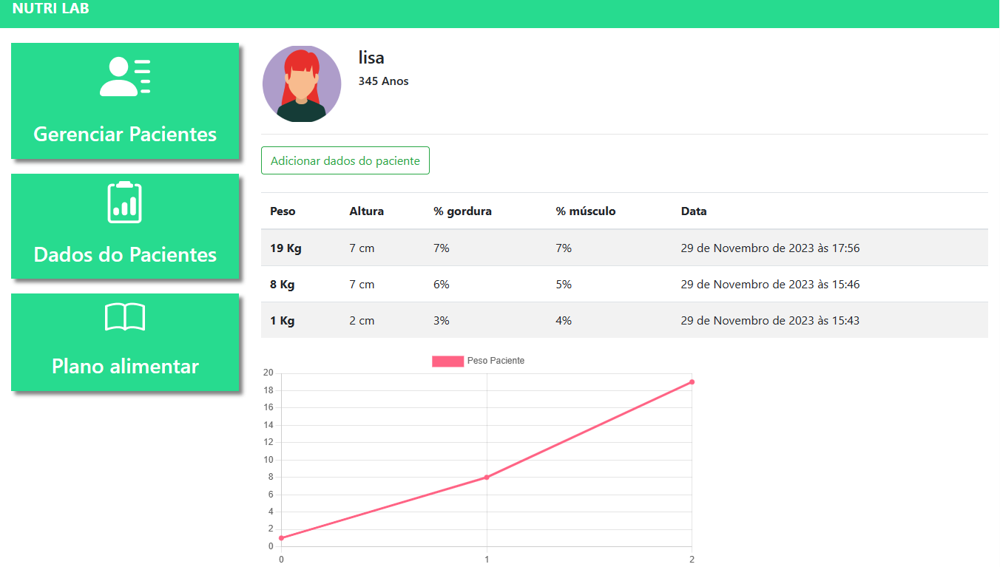
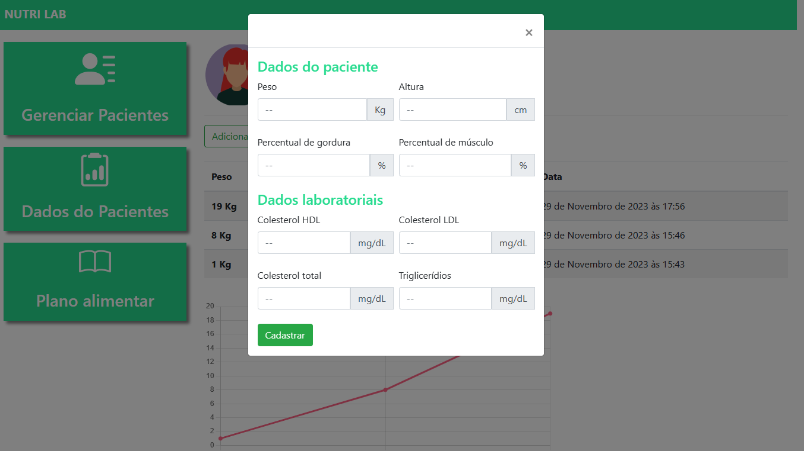
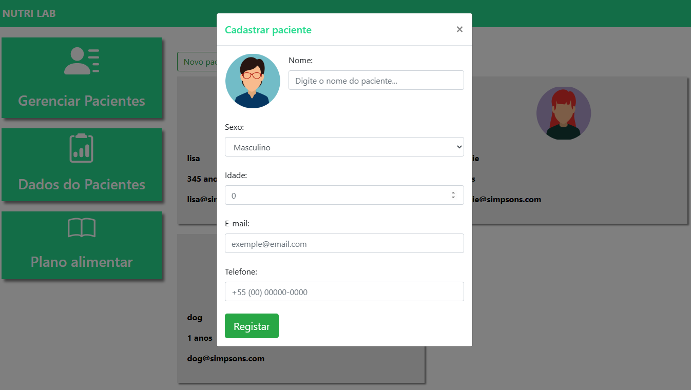
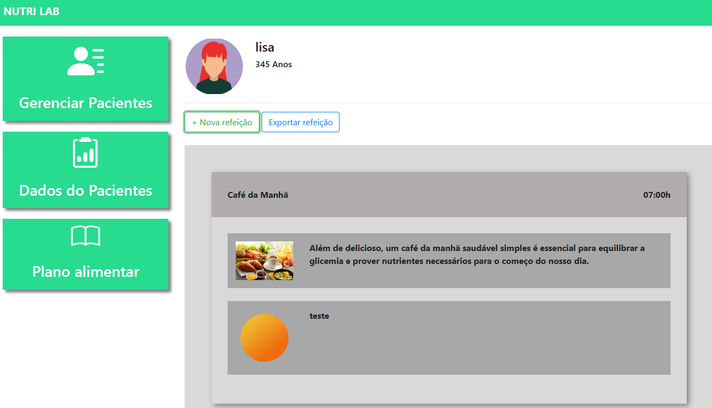
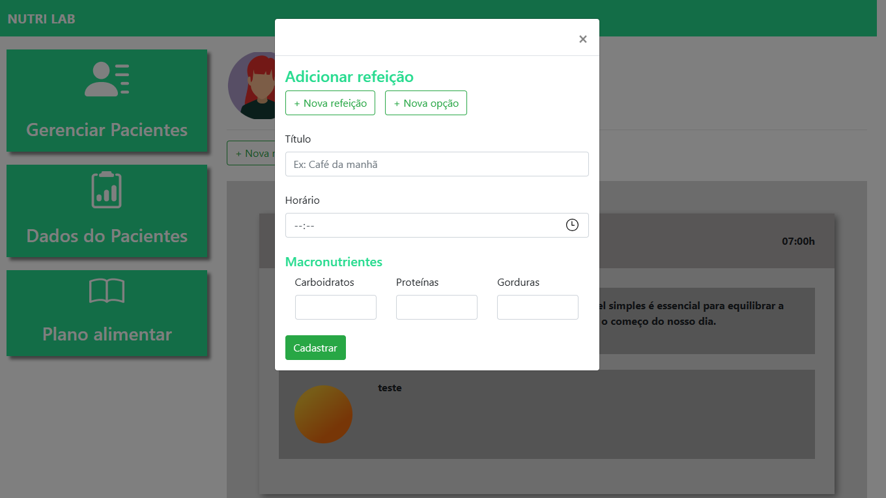

# Nutri Lab - Django Project

## Simple nutritionist system to manage your clients

### You can:

###### - Signup new Nutritionist

###### - Activate nutritionist account by email

###### - Login Nutritionist

###### - Register new clients

###### - Log client history with chart

###### - Log meal plan for each client

###### - Register new meals

###### - Register options for each meal

###### - Upload meal pic

###### - Export client's meal plan to PDF

---

To run the project you need to have [Python](https://www.python.org/downloads/) and [wkhtmltopdf](https://wkhtmltopdf.org/downloads.html) pre installed.

Create a directory to the project and inside of it run this in cmd to create a virtual environment:
`python -m venv venv`

Now you need to activate the virtual environment. If you are under Linux or Mac run in cmd:
`source /venv/bin/activate`

If you are under windows run this in cmd:
`/venv/bin/activate.bat`

Once it is done, run in cmd:
`pip install -r requirements.txt`

Inside the project directory nutrilab, you have a .env_copy file containing the fields that you must specify to run the project.
If you are under windows, those are pdf fields examples:

```
# Django secret key
SECRET_KEY=

# PDF info
path_wkhtmltopdf=C:/Program Files/wkhtmltopdf/bin/wkhtmltopdf.exe
path_to_save_pdf=C:/python_projects/nutrilab/pdf

# Email
EMAIL_USE_TLS=
EMAIL_HOST=
EMAIL_PORT=
EMAIL_HOST_USER=
EMAIL_HOST_PASSWORD=
EMAIL_BACKEND=django.core.mail.backends.console.EmailBackend
EMAIL_BASE=http://localhost:8000
```

For the test purpose, about the email fields, you can put any data because in the `EMAIL_BACKEND` variable we are using: `django.core.mail.backends.console.EmailBackend`
To send the email for real this must be changed to: `django.core.mail.backends.smtp.EmailBackend`

To run the project:
`python manage.py runserver`

To create a super user:
`python manage.py createsuperuser`

To enter the admininstration of the app, in the browser enter:
`http://127.0.0.1/admin/`

Enter the user you created in the step before.

In the cmd run this command to create the tables in database:
`python manage.py migrate`

---







Tiago Mendes
tetigo@gmail.com
